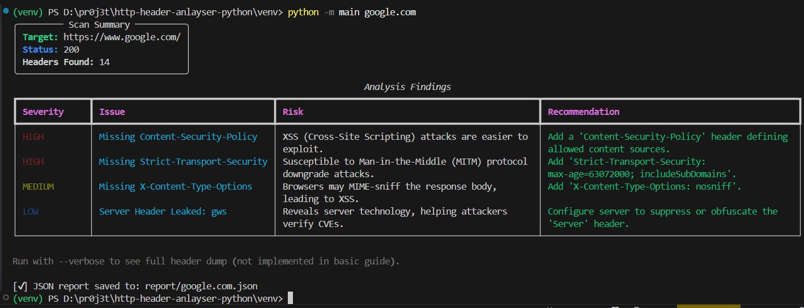

# HTTP Header Analyzer

A Python-based CLI tool to analyze HTTP headers for security vulnerabilities, information leakage, and configuration issues.


A screenshot demonstrating the CLI tool's output.


## Features

- **Security Analysis**: Checks for missing or misconfigured security headers (CSP, HSTS, X-Frame-Options, X-Content-Type-Options).
- **Information Leakage**: Detects leaked server versions and technology stacks (Server, X-Powered-By).
- **CORS Validation**: Identifies dangerous CORS configurations (Access-Control-Allow-Origin).
- **Performance**: Checks for caching headers (Cache-Control).
- **Parallel Scanning**: Scan multiple URLs concurrently for faster results.
- **JSON Export**: Save analysis reports to a JSON file for further processing.
- **Rich Output**: Beautiful, readable terminal output using the `rich` library.

## Installation

1. Clone the repository.
2. Navigate to the project directory.
3. Install the required dependencies:

   ```bash
   pip install -r venv/requirements.txt
   ```

   _(Note: Adjust the path to `requirements.txt` if necessary)_

## Usage

Run the analyzer from the command line using `src/cli.py`.

```bash
python -m main <URL> [OPTIONS]
```

### Options

- `url`: One or more target URLs to scan.
- `--method`: HTTP method to use (`GET` or `HEAD`). Default: `GET`.
- `--no-redirect`: Do not follow HTTP redirects.
- `--timeout`: Request timeout in seconds. Default: `10`.
- `--json <file>`: Save the report to a JSON file (Single URL only).
- `--parallel`: Enable parallel scanning when multiple URLs are provided.

### Examples

**Basic Scan:**

```bash
python -m main https://example.com
```

**Scan Multiple URLs in Parallel:**

```bash
python -m main https://example.com https://google.com --parallel
```

**Save Report to JSON:**

```bash
python -m main https://example.com --json report.json
```

## Project Structure

- `src/cli.py`: Main entry point for the CLI.
- `src/analyzer.py`: Core logic for analyzing HTTP headers.
- `src/requester.py`: Handles HTTP requests and retries.
- `src/reporter.py`: Generates CLI and JSON reports.
- `src/utils.py`: Helper functions (e.g., URL normalization).
- `tests/`: Unit tests for the application.
- `main.py ` : main file to execute the all.

## Dependencies

```bash
pip install -r requirements.txt
```

- `requests`: For making HTTP requests.
- `urllib3`: For retry logic.
- `rich`: For pretty terminal output.

-----
## 2. DOCKER
 
```bash
FROM python:3.9-slim-buster

WORKDIR /app

COPY requirements.txt .
RUN pip install --no-cache-dir -r requirements.txt

COPY . .

ENTRYPOINT ["python", "main.py"]

````

```bash
# Build the Docker image
docker build -t header-analyzer .

# Run the analyzer with an example URL and mount a volume for reports
docker run -v "$(pwd)/report:/app/report" header-analyzer https://example.com --json /app/report/example_report.json

````
